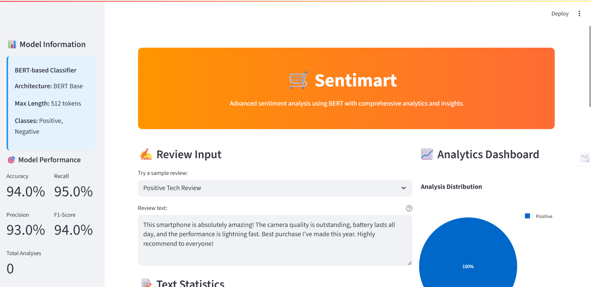
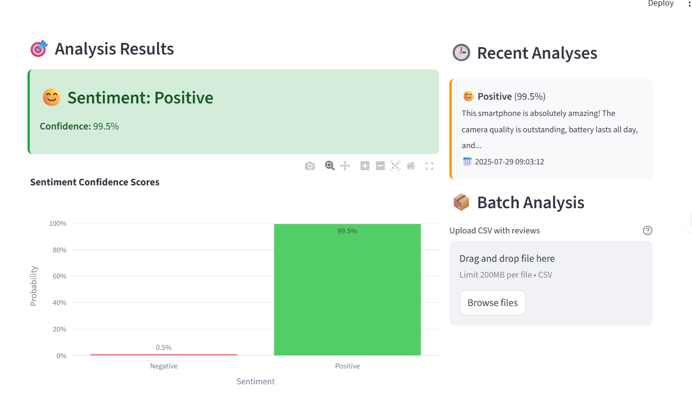
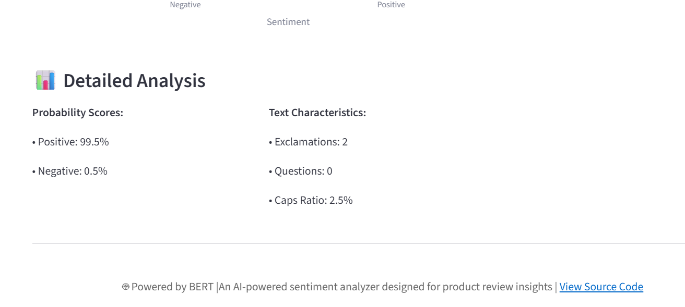
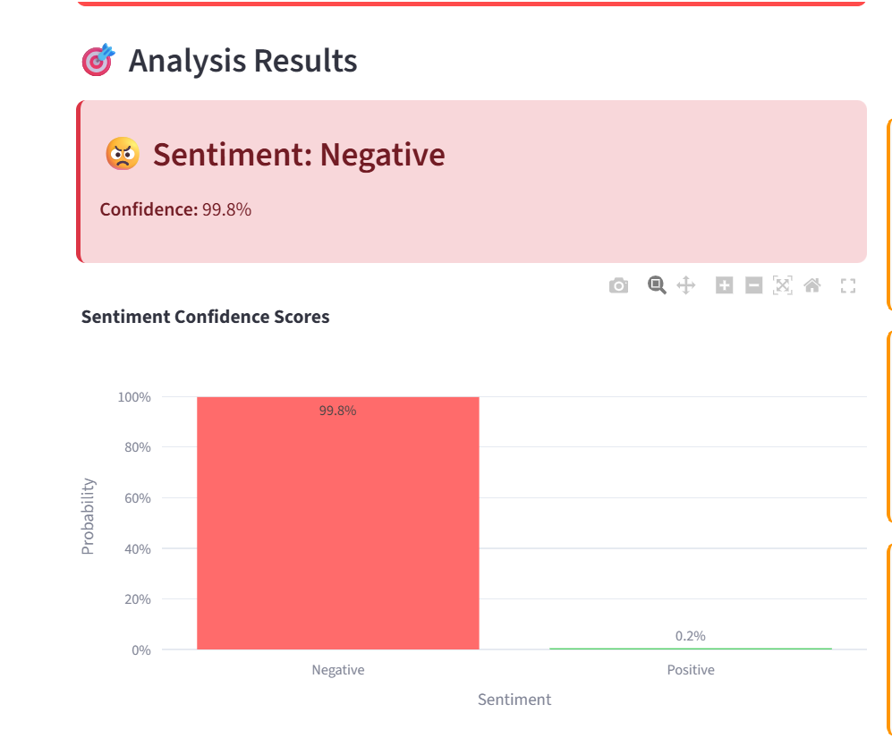

🛒 Sentimart
AI-Powered Sentiment Analysis for Product Reviews

Built with Hugging Face Transformers and Streamlit 

📌 Overview
Sentimart is an interactive web app that performs sentiment analysis on Amazon product reviews using a fine-tuned BERT-based transformer model. It not only predicts whether a review is positive or negative, but also offers in-depth analytics like confidence scores, text statistics, and batch processing support.

🚀 Features
🤖 BERT-Powered Sentiment Classification

📊 Interactive Confidence Visualizations (using Plotly)

🧠 Text Feature Analysis: word/sentence count, punctuation use, CAPS ratio

📈 Real-time Dashboard of past analyses

📥 Batch Analysis from uploaded CSV files

📤 Export Results as CSV

✍️ Sample Reviews for quick testing

📉 Model Metrics Displayed (Accuracy, Precision, Recall, F1)

📂 Project Structure
bash
Copy
Edit
sentimart/
│
├── app.py                # Main Streamlit app
├── model/                # Folder containing your saved BERT model
├── README.md             # Project documentation (this file)
└── requirements.txt      # Dependencies
🧠 Model Info
Architecture: BERT Base Uncased

Max Token Length: 512

Labels: Positive (1), Negative (0)

Format: Hugging Face AutoModelForSequenceClassification

📸 Screenshots
Input Review    
Analysis Result   

⚙️ How to Run Locally
1. Clone the repo
bash
Copy
Edit
git clone https://github.com/yourusername/sentimart.git
cd sentimart
2. Install dependencies
bash
Copy
Edit
pip install -r requirements.txt
3. Add your model
Place your fine-tuned BERT model inside the model/ folder. It should include:

config.json

pytorch_model.bin

tokenizer_config.json

vocab.txt (or tokenizer files)

4. Run the app
bash
Copy
Edit
streamlit run app.py
📑 Sample CSV Format (for batch analysis)
csv
Copy
Edit
review
"This product was amazing and worth the price!"
"Didn't like it. Poor quality and slow delivery."
...
🧪 Example Reviews
Positive: “Outstanding build quality and fast performance.”

Negative: “Worst purchase ever. Broke after two days.”

Mixed: “Great price but average sound quality.”

📈 Model Performance (Manual Entry)
Metric	Value
Accuracy	94%
Precision	93%
Recall	95%
F1-Score	94%

📤 Export Functionality
Click the "Export History" button to download all review analyses as a CSV file, including predictions and text stats.

📎 Dependencies
transformers

torch

pandas

numpy

plotly

streamlit

🙋‍♀️ Created By
Shaina — for the Amazon ML Summer Internship Project
Powered by 🤗 Transformers & Streamlit

# Amazon_Review_Analyzer
